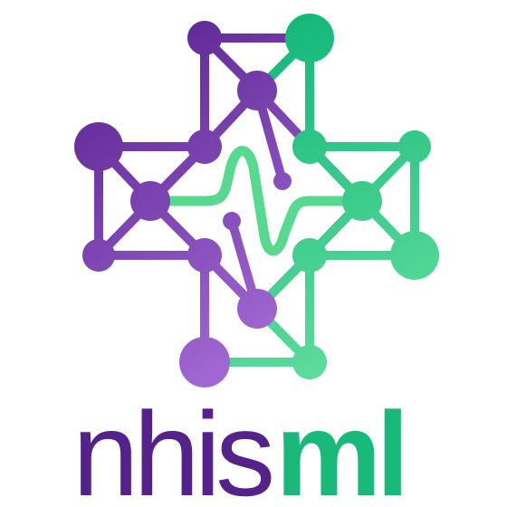

# nhisml

**nhisml** is a survey-aware machine learning toolkit for the [National Health Interview Survey (NHIS)](https://www.cdc.gov/nchs/nhis/index.html) Adults public-use microdata. It provides a reproducible, end-to-end pipeline — from raw data download through model training, cross-year evaluation, and subgroup fairness analysis — designed for researchers in public health, epidemiology, and health services research.

## What the package provides

- NHIS-aware preprocessing, including missing-code remapping and survey weights
- Built-in binary prediction tasks for self-rated health and current smoking
- Reproducible baseline training with out-of-fold threshold tuning
- Cross-year evaluation and subgroup performance reporting
- Reference statistics for validating downloaded and processed data

Start with the [getting started guide](getting-started.md), or browse the
[command-line interface](cli.md) and [Python API](api.md).